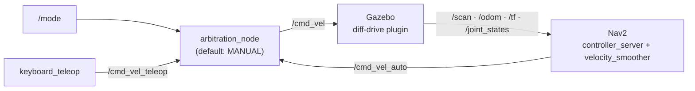

# Farm Scout Audit — Where the Project Actually Stands

*A full read-through of every package, launch file, config, and script in `ros2-farm-scout-FYP` — checked against what's actually installed and what `PROJECT_STATUS.md` says, not assumed from the README.*

**Scope:** this git repository only. A separate thesis/report document, if one exists outside it, was not reviewed.

---

## 01 · The short version

The engineering is genuinely competent — a real dual-mode control architecture, a carefully tuned Nav2 stack, and three separately diagnosed SLAM failure modes with actual root causes, not guesses. What's causing the "losing my way" feeling isn't the code quality. It's that **Phase 0 is the only phase fully closed out**, and Phases 1 through 11 — including the entire 50-trial experiment and every report chapter — are still ahead. That gap is worth seeing clearly rather than feeling vaguely.

> **🚩 Flag — presentation date.** `PROJECT_STATUS.md` records the presentation — live demo plus results and graphs, to your supervisor — as **August 19, 2026**. Today's date is also August 19, 2026. Confirm with your supervisor whether that date is still current before doing anything else in this list — it changes which of the two paths in [§08](#08--recommended-next-steps) actually applies.

Two structural questions have sat open since at least Phase 5 was written and are worth resolving early, because they touch the README, the report, and any live demo: which robot is actually "the" project robot ([finding](#robot-model)), and whether the auto-switching behaviour described in the methodology needs to be built or the methodology needs to be rewritten to match what's actually implemented ([finding](#auto-trigger)).

**Quick numbers:** 6 packages · 1 of 12 phases done · 0 automated tests · 2 blocking issues.

---

## 02 · What this project is

A simulated agricultural field-scouting robot with **two control modes it can switch between at runtime**, and a research question about how safely that switching holds up. It runs in a 22×24 m Gazebo world laid out as five maize rows of ten plants each, with a rock, a crate, and a post as static obstacles.

- **Manual** — a human drives it with a keyboard. This is the default on startup, and the only mode active until someone explicitly switches.
- **Auto** — Nav2 drives it through a boustrophedon (lawnmower) sweep of all five aisles, end to end, then back to the start point.

The actual research property under test is narrower than "can it drive the field": **if Nav2 goes silent for more than 0.5 seconds while in auto mode, the robot must stop.** That fallback, and how it behaves across five planned failure scenarios (normal run, obstacle in the row, narrow passage, sensor disturbance, dynamic obstacle) repeated ten times each, is the actual 50-trial experiment the whole rest of the pipeline (Phases 6–10) exists to produce.

---

## 03 · Architecture

One node sits at the center of the whole safety argument: `arbitration_node`. It is the *only* thing in the system allowed to publish `/cmd_vel` — Nav2 and the teleop node each write to their own topic, and arbitration picks one based on `/mode`.

One asymmetry worth knowing: the 0.5 second dead-man's timeout in `arbitration_node` — the safety property this whole FYP is about — **only applies while in AUTO mode**. In MANUAL mode, the node simply re-publishes whatever the teleop node last sent, with no staleness check of its own. That's a reasonable design (a human is presumed present in manual mode), but it means the timeout literally cannot be exercised or measured except by testing AUTO mode specifically — worth being precise about in the report's methodology section.

---

## 04 · Package inventory

Six packages, all `0.1.0`, all Apache-2.0. No package has a single automated test.

| Package | Status | Notes |
|---|---|---|
| `farm_world` | ✅ Working | SDF world: 50 maize plants across five rows, three static obstacles, boundary walls, fixed top-down/north-up GUI camera (added 2026-08-18). Depends on [`virtual_maize_field`](https://github.com/FieldRobotEvent/virtual_maize_field) for plant meshes — deliberately gitignored, must be cloned separately. Has already gone missing once after a workspace clear. |
| `robot_description` | ⚠️ Orphaned | A fully worked-out custom differential-drive robot (dimensions, mass, wheels, LIDAR, camera, IMU, all wired to Gazebo Harmonic plugins). Nothing else in the codebase uses it — only an RViz-only `display.launch.py` loads it. |
| `teleop_node` | ✅ Working | Keyboard teleop, w/a/s/d + arrows, publishes `TwistStamped` to `/cmd_vel_teleop` at 10 Hz. 0.4s dead-man's switch confirmed intentional. |
| `mode_arbitration` | ✅ Working | `arbitration_node` — confirmed via source read to default to MANUAL and correctly gate `/cmd_vel` on `/mode`. Not started by `simulation.launch.py` alone; only `full_system.launch.py` brings it up. |
| `nav2_config` | 🔴 Map missing | Thorough, hand-tuned Nav2 parameter set (AMCL, DWB, both costmaps, planner, smoother, behavior server, waypoint follower, SLAM Toolbox) matched to the robot's real 0.35 m/s speed and 3.5 m LIDAR range. `maps/` is currently empty. |
| `robot_bringup` | 🟡 In progress | Top-level launch orchestration + `scout_mission.py` (Nav2 waypoint-follower boustrophedon) and `slam_coverage_drive.py` (new scripted SLAM driver, unproven in sim). |

---

## 05 · Findings

Eleven findings, most-severe first. **Blocking** stops today's demo path cold as configured. **High** will produce a visible failure or a claim in the report that doesn't match the live system. **Medium** is real but has a known workaround. **Low** is hygiene.

| Severity | Finding | Where |
|---|---|---|
| 🔴 Blocking | No saved map; AMCL launch path's default map path doesn't exist | `nav2_config/maps/` |
| 🔴 Blocking | Phases 2–11 not started — no localisation test, no autonomous-nav test, no trials, no analysis, no report chapters in this repo | `PROJECT_STATUS.md` |
| 🟠 High | SLAM coverage script reviewed clean, never run against the sim | `robot_bringup/scripts/slam_coverage_drive.py` |
| 🟠 High | Two robot models in the repo; only one is actually simulated | `robot_description/` vs `farm_world/worlds/farm.sdf` |
| 🟠 High | Methodology describes auto-triggered mode switching; implementation is manual-only | `mode_arbitration/mode_arbitration/arbitration_node.py` |
| 🟡 Medium | Three distinct SLAM failure modes hit so far, each cost a full session | `PROJECT_STATUS.md` |
| 🟡 Medium | Gazebo camera cache silently reverts the GUI view on every normal close | `~/.gz/sim/8/gui.config` |
| 🟡 Medium | README stale in 4+ checkable ways vs. the actual running system | `README.md` |
| ⚪ Low | Dead YAML block — lifecycle manager config that's never actually read | `nav2_config/config/nav2_params.yaml:397-427` |
| ⚪ Low | Zero automated tests in any package | all packages |
| ⚪ Low | Required third-party asset repo is gitignored and easy to forget on a fresh clone | `virtual_maize_field` |

### Blocking

**No saved map, and the AMCL path's default won't find one anyway.**
`nav2_config/maps/` is empty — `farm_map.yaml` was deleted from the working tree and never regenerated; every SLAM-mapping attempt so far has ended in a failure mode before a map got saved. Independent of that, `full_system.launch.py` and `navigation.launch.py` both hardcode the `map_file` default to `/home/adejirea/ros2_ws/src/nav2_config/maps/farm_map.yaml` — a path that has never existed in this workspace, since the package actually lives under `~/ros2_ws/src/ros2-farm-scout-FYP/nav2_config/...`. Running `full_system.launch.py use_slam:=false` today would fail on the missing map before the path bug even mattered.

**Phases 2 through 11 haven't started.**
Nothing in this repository reflects AMCL testing, autonomous-navigation testing, mode-switch testing, the five scenario definitions, trial-recording infrastructure, the dry run, the 50-trial experiment itself, its analysis, or the report chapters. This audit only covers the code repository — if report chapters or the thesis document live elsewhere, they're outside what was checked here. But nothing in `PROJECT_STATUS.md`'s own phase checklist suggests otherwise either: every box past Phase 0 is still unchecked.

### High

**`slam_coverage_drive.py` is reviewed clean, not proven.**
This script is the actual unblock for Phase 1. It went through three rounds of review — a TF-buffer staleness fix, an aisle-transition rewrite, and a one-line heading correction — and the last review traced every turn angle-by-angle and found it internally consistent. But "traced correctly on paper" and "ran clean against a live TF tree with real sensor noise and real physics" are different claims. It has never actually been executed in the simulator. That first live run is the single highest-leverage thing left to do.

**Two robot models; only one is real in the sim.**
`robot_description/urdf/agricultural_robot.urdf.xacro` is a complete, carefully authored custom robot: 0.60×0.40×0.20 m, 25 kg, differential drive, a 12 m-range LIDAR, a front camera, an IMU — all correctly wired to Gazebo Harmonic plugins. It is **not used anywhere in the actual simulation, navigation, or mission stack.** Every launch file that actually spawns a robot (`simulation.launch.py`, and by extension `farm_world/worlds/farm.sdf`) uses an off-the-shelf TurtleBot3 Waffle instead, with a real 3.5 m LIDAR range. `README.md`'s "Robot specs" table documents the custom robot's numbers as if they were the simulated robot's — they aren't. This was already logged as an open decision in `PROJECT_STATUS.md`'s Phase 5 ("document TB3 Waffle as-simulated, or swap in the custom URDF?") and it's worth closing before it reaches the report, since Section 3.4 (Robot Model) will otherwise describe a robot that was never actually tested.

**Auto-trigger switching is described but not implemented.**
Read in full: `arbitration_node.py` switches modes on exactly one input — a string published to `/mode` by a human or a script. There is no condition anywhere in the codebase (obstacle detected, sensor fault, geofence, battery, anything) that triggers a mode switch on its own. `PROJECT_STATUS.md` Phase 5 already flags this as an open decision against "Methodology 3.7.1 + Recommendation 5.2(ii)" — either a minimal auto-trigger needs to be built, or those sections need rewriting to describe the real manual-only mechanism. Left unresolved, it's the kind of mismatch a supervisor catches in the first five minutes of a live demo.

### Medium

**Three distinct SLAM failure modes, each diagnosed, none fully closed.**
In order: **(1)** scan-match drift from fast turns producing a doubled/duplicated box in the map; **(2)** a discrete `map→odom` pose-graph jump — traced to a specific timestamp via `nav2_costmap_2d`'s log output, confirmed to sit entirely in the global localisation estimate rather than short-term odometry, and confirmed *not* caused by a slam_toolbox restart; **(3)** incomplete coverage (south/east edges came up short) despite a drive that looked clean and closed visually. A real, separate misconfiguration — `slam_toolbox`/AMCL's laser range set to 12 m against a LIDAR that's actually simulated at 3.5 m — was found and fixed, but it was never confirmed as the cause of either failure; it was a genuine bug worth fixing regardless, not a proven root-cause fix. All three failure modes are documented in detail in `PROJECT_STATUS.md`, which is itself a real asset: this is diagnosed history, not a mystery.

**Gazebo's GUI camera cache overrides the world file, silently, every time.**
`~/.gz/sim/8/gui.config` — a per-machine cache file outside this repo — silently overrides `farm.sdf`'s fixed top-down camera whenever it exists, and gets rewritten with a stale oblique default on *every normal Gazebo window close*, not just after someone manually orbits the view. The world file's own camera config is correct; the workaround (`rm -f ~/.gz/sim/8/gui.config` before each launch) is documented and confirmed effective, but nothing in the launch chain does it automatically — this was a deliberate scope decision, not an oversight, so it will keep resurfacing.

**README is stale against the running system in several checkable places.**
Spawn point is documented as `(0, −11)`; the actual spawn point has been `(8, −10)` since 2026-08-15, in both `farm.sdf` and `scout_mission.py`. The "Robot specs" table and the mission-profile ASCII diagram both inherit the same staleness. The LIDAR range listed (12 m) is the pre-fix, wrong value — the actually-simulated TB3 Waffle's range is 3.5 m, which is what the config now correctly says. None of this is subtle; anyone comparing the README to a live launch will notice within the first minute.

### Low

**Dead lifecycle-manager config in `nav2_params.yaml`.**
The `lifecycle_manager` and `lifecycle_manager_slam` blocks at the bottom of `nav2_params.yaml` (including `bond_timeout: 30.0`) are never actually loaded — `navigation.launch.py` builds that node's parameters entirely inline, including a different, hardcoded `bond_timeout: 0.0`. Harmless today, but a real trap for whoever edits the YAML block later expecting it to change live behaviour.

**No automated tests anywhere.**
Zero test files across all six packages — not unusual for a simulation-heavy FYP where verification is inherently manual/visual, but worth naming so it's a conscious choice rather than an oversight. Even a handful of launch-file "does it come up clean" smoke tests would have caught some of the config issues above earlier.

**External asset dependency is easy to lose.**
`virtual_maize_field` — the source of every plant mesh in the world — is deliberately gitignored as a large third-party package and must be manually cloned into `~/ros2_ws/src/`. It has already gone missing once, on the very first Phase 0 attempt, and broke world loading in a way that looked like a code bug. Documented as a re-clone step in both the README and `PROJECT_STATUS.md`, but nothing prevents it recurring on a fresh machine or a grading environment.

---

## 06 · Phase roadmap status

As logged in `PROJECT_STATUS.md`, checked against the repo. This is the project's own dependency-ordered plan, not one imposed by this audit.

| # | Phase | Status | Notes |
|---|---|---|---|
| 00 | Sanity check | ✅ Done | All 6 items pass — build, sim launch, sensor topics, teleop, mode arbitration, `scout_mission` registration. |
| 01 | SLAM remap | 🔴 Blocked | 3 manual attempts, 3 distinct failure modes. Scripted driver built and reviewed clean, not yet run. |
| 02 | AMCL test | ⚪ Not started | Needs a saved map from Phase 1 first. |
| 03 | Autonomous navigation test | ⚪ Not started | Single goal, then full `scout_mission.py` run. |
| 04 | Mode-switch test | ⚪ Not started | Manual override mid-navigation, clean resume. |
| 05 | Quick decisions + fixes | 🟡 Open | Robot-model and auto-trigger decisions still open (see findings). License check, docstring fix, branch cleanup — all cheap, none done. |
| 06 | Define the 5 scenarios | ⚪ Not started | Concrete, implementable trigger mechanisms — not written yet. |
| 07 | Trial infrastructure | ⚪ Not started | `record_trial.sh`, `trial_reset.py`, `analyse_trials.py` — none exist yet. |
| 08 | Dry-run validation | ⚪ Not started | One trial per scenario before committing to all 50. |
| 09 | Run the experiment | ⚪ Not started | All 50 trials — 5 scenarios × 10 reps. |
| 10 | Analysis | ⚪ Not started | Tables and charts from the 50-trial dataset. |
| 11 | Report | ⚪ Not started | All chapters, front matter, and Phase-5 decisions applied to Methodology/Recommendations — not reflected in this repo. |

---

## 07 · What's actually solid

Worth stating plainly, because an audit that only lists problems gives a false picture: the parts of this project that are built are built well.

- **The core architecture is correct and defensible.** A single arbitration point for velocity commands, with mode as the only thing that changes which source wins, is exactly the right shape for the safety question this FYP is asking.
- **The Nav2 tuning is real tuning, not copied defaults.** Velocity limits, costmap inflation, and DWB critic weights all trace back to this robot's actual 0.35 m/s top speed and the field's real dimensions — someone sat with these numbers.
- **`PROJECT_STATUS.md` is doing exactly the job a status file should.** Every failure mode hit so far is dated, root-caused, and cross-referenced rather than lost to memory. That discipline is precisely what turns "three SLAM sessions went wrong" from a vague bad feeling into three concrete, citable findings — which is a legitimate result to put in front of a supervisor even before Phase 1 formally closes.
- **Phase 0 wasn't rubber-stamped.** All six checks were independently verified against real topic output, not assumed from the code.

---

## 08 · Recommended next steps

Which of these applies depends on the one open question from [§01](#01--the-short-version): is the presentation really today?

> **If the date is firm and unmovable:** Don't try to backfill Phases 2–11 in the time available — that's not recoverable today, and attempting it risks a worse outcome than presenting honestly. Demo what's real and working (Phase 0: sim, teleop, mode arbitration, the architecture itself) and present the SLAM diagnosis as a legitimate result: three independently root-caused failure modes is a real engineering finding, not a gap to hide. Be upfront that Phase 1 is in progress with a reviewed-but-unrun fix in hand.

> **If there's more runway than the file currently says**, three concrete actions, in order:
> 1. **Run `slam_coverage_drive.py` live** and get one clean saved map. This is the single highest-leverage unblock in the repo right now.
> 2. **Fix the `map_file` default path** in `full_system.launch.py` / `navigation.launch.py`, and decide the robot-model question (custom URDF vs. TB3-as-simulated) before it touches the README or the report.
> 3. **Close Phase 2 (AMCL) against that map** before starting Phase 3 — the whole rest of the pipeline depends on localisation actually working first.

---

*Audit performed by reading every package manifest, launch file, config, and script in the repository directly — cross-checked against installed build output and `PROJECT_STATUS.md`, not inferred from the README.*
